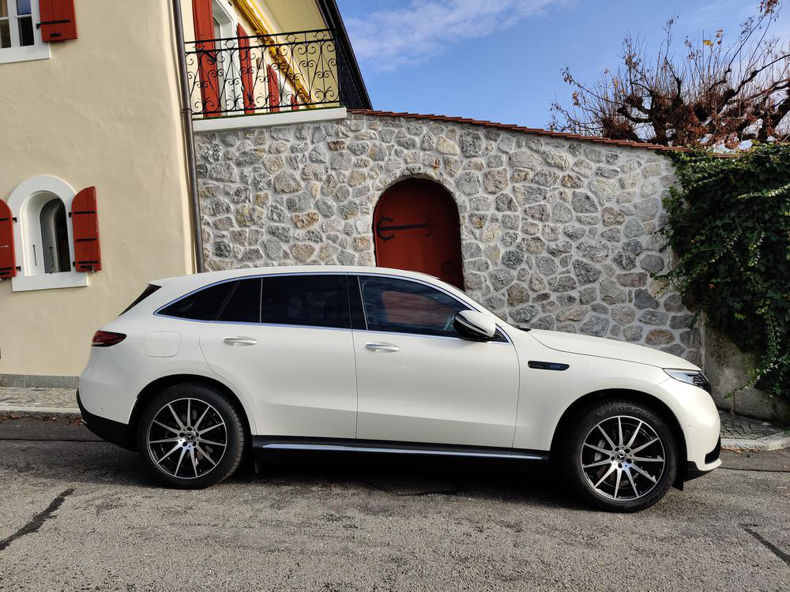
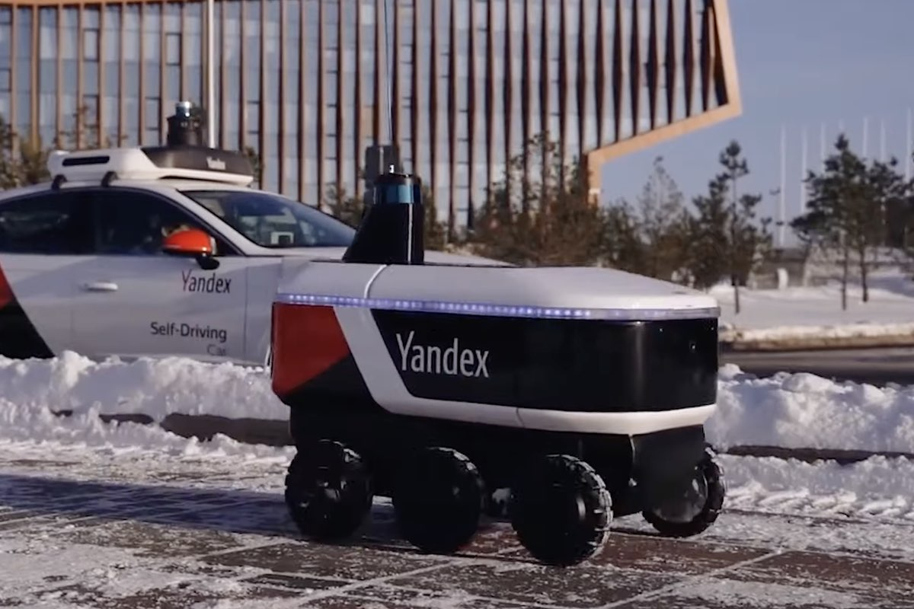
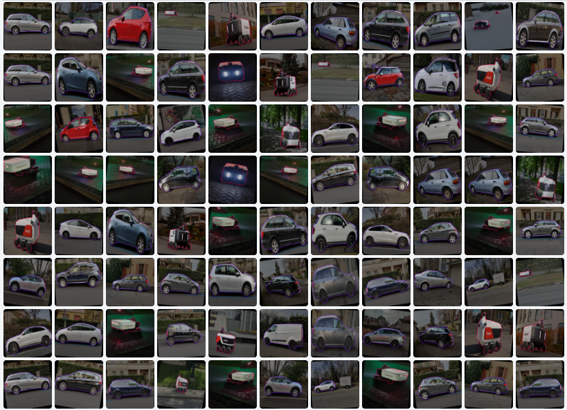

# Rovers_vs_Cars
In this project we tackle the segmentation task using two of the most famouse models Yolov8 and Mask RCNN. This repo could serve as simple guide with code for anyone in the process of learning how to use these models with a custome datasets.

---

## Data collection
Images of cars and Yandex delivery robot were collected from the internet. Some photos were taken manually by phone too.

  

  

## Dataset Annotation
Roboflow was used to data annotation is a very useful tool, and it can export the data in any foramt.

  

## Training 
1.  [YOLOv8](YOLOv8.ipynb)
2.  [Mask RCnn](detectron2.ipynb)

## Evaluation 
| Model       | mAP         |  Speed         |
| :---        |    :----:   |           ---: |
| Yolov8      |  84.31      | 34.1  ms       | 
| Mask RCNN   | 76.07       |120 ms          |

